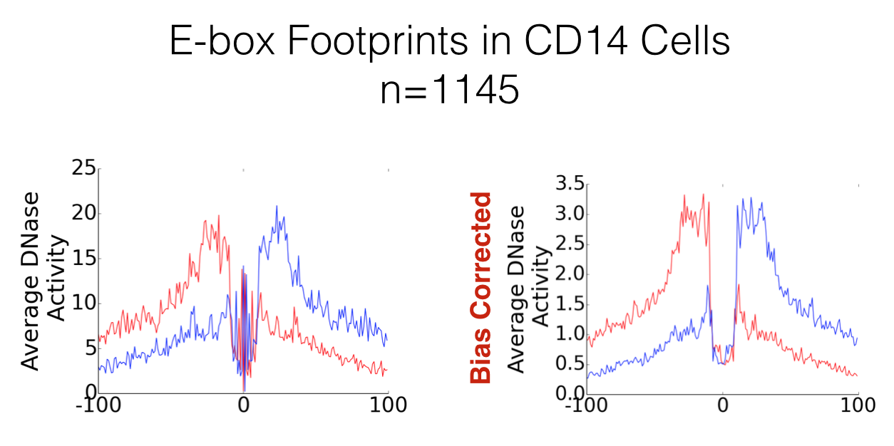

.. _biascorrecting:

DNase I cleavage bias correction
--------------------------------

pyDNase 0.2.0 comes with consideration for DNase-seq cutting bias. At the moment, this is a preliminary implementation limited to just the visualisation functions ``dnase_average_profile.py`` and ``dnase_to_javatreeview.py``. Instead of DNase-seq read counts, this instead reports the fold change over a theoretical background model using the bias values reported in the IMR90 naked genomic DNA reported in `He et al. 2014 <http://www.nature.com/nmeth/journal/v11/n1/full/nmeth.2762.html>`_

This is currently not a part of the core Wellington footprinting function, as a more thorough analysis of the impact of introducing such a feature on the method is needed here.

How is this useful?
~~~~~~~~~~~~~~~~~~~

Often, people use ``dnase_average_profile.py`` and ``dnase_to_javatreeview.py`` to visualise the footprints of a specific transcription factor. When this is the case, the plot will be centred on a common motif, and sequence specific cutting biases have the potential to become very apparent. As an example, footprinted E-box motifs have a heightened cutting profile in the centre of the footprint. These were theorised by `Neph et al. 2012 <http://www.nature.com/nature/journal/v489/n7414/abs/nature11212.html>`_ to be caused by conformational changed to the DNA induced by the binding of the transcription factor. However, we can show here that this is not that case, and by accounting for sequence bias these patterns dissapear.

Great! What's the catch?
~~~~~~~~~~~~~~~~~~~~~~~~

There are two catches here. The first is that this doesn't work well on regions with low numbers of reads. If your read depth is really low for the regions you are trying to plot, your data might not look good. Second, this is no longer reporting read counts, but a "fold change". This is more of an implementation issue as we felt proper methods for accounting for DNase cleavage bias are best left for another study.