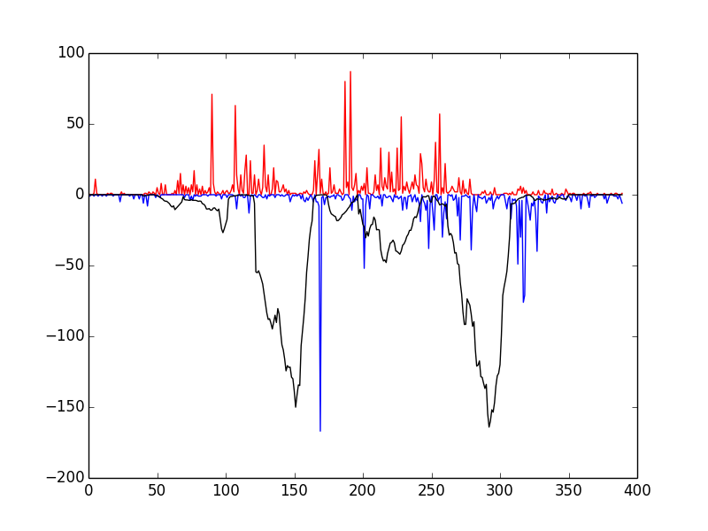
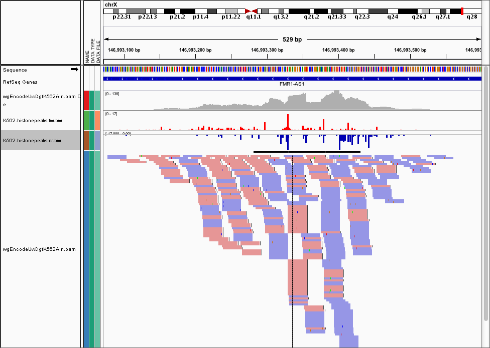

.. _tutorial:

DNase-seq footprinting Tutorial
-------------------------------

This document gives you a brief outline on how to analyse DNase-seq data. It assumes knowledge of the unerlying biological method, and is meant to help those that generally understand how to use the terminal to perform simple bioinformatic analyses. If you want to brush up on your DNase-seq before continuing, the HOMER_ docs, the `Wellington Paper <http://nar.oxfordjournals.org/content/41/21/e201.full>`_, the `ENCODE DNase-seq paper <http://www.nature.com/nature/journal/v489/n7414/abs/nature11212.html>`_, are good places to start.

Testing pyDNase installation
~~~~~~~~~~~~~~~~~~~~~~~~~~~~

After installing pyDNase, go ahead and run::

    $ example_footprint_scores.py

This script tests that everything has been installed and runs correctly. You should see the following window


    
If so, congratulations! Everything has installed properly. The red and blue bars correspond to cuts on the positive and negative strand, respectively, and the black line represents the raw Wellington footprint scores.

Getting data in the correct format
~~~~~~~~~~~~~~~~~~~~~~~~~~~~~~~~~~

The first, and most important thing you need is the aligned reads from the DNase-seq experiment. If you are working with ENCODE data, you can get the data pre-aligned in ``.bam`` format from here. Note that you must download the corresponding ``.bam.bai`` file, which is the index file. You can find Dgf (digital genomic footprinting) reads and hypersensitive sites from the `wgEncodeUwDgf folder on the UCSC GoldenPath server <http://hgdownload.cse.ucsc.edu/goldenPath/hg19/encodeDCC/wgEncodeUwDgf/>`_. Note that these are different thana those found in the ``wgEncodeOpenChromDnase`` and ``wgEncodeUwDnase`` folders, which are not of sufficient sequencing depth to get a good number of footprints from.

Do note that there are two different DNase protocols - the *single-hit* method described by Boyle et al, and the *double-hit* method described by Sabo et al. All of the data generated by ENCODE under the ``wgEncodeUwDgf`` label all uses the *double-hit* method (the assay is easier to perform and the data is cleaner, so I don't envisage the *single-hit* method coming back). Do not that whilst Wellington can be run on the *single-hit* data, it hasn't been designed to do so.

If you're on the cutting edge, such as generating your own DNase-seq data or using some of the raw (unaligned) data from the NIH roadmap epigenomics project, then you'll need to align the FASTQ files from your sequencer yourself (outlined below).


Aligning your reads
~~~~~~~~~~~~~~~~~~~

I used to use Bowtie 1 with the settings (this is basically how all the ENCODE data is aligned)::

    $ bowtie -t -p 8 -v 2 -m 1 --all --best --strata --sam hg19 -f -1 <input.fastq> > <output.sam>

But this has several limitations - the suppression of non-uniquely mapping reads angers Lior Pachter, ``bowtie`` doesn't do well with long reads, and ``bowtie`` can't handle indels. So where possible, use ``bowtie2``, which I usually use with the default settings (example below)::

    $ bowtie2 -x hg19 -t -p 8 -q -U <input.fastq> -S <output.sam>

Indels can create 'fake' footprints as they lead to short regions where no sequences can align, so when comparing different samples this becomes important!

Dealing with SRA 
````````````````
If you're getting files from the SRA, you'll need to convert the files from the propietry ``.sra`` format to ``.fastq`` ``sratoolkit``. Download and install ``sratoolkit`` from here and, and then use ``fastq-dump`` to convert to either convert to FASTQ directly, or pipe directly to ``bowtie2`` such as::

    $ fastq-dump <reads.sra> -Z | bowtie2 -x hg19 -t -p 8 -q -U - -S <output.sam>

.. ``fastq-dump <reads.sra> -Z | bowtie -t -p 8 -v 2 -m 1 --all --best --strata --sam hg19 -f -1 - > <output.sam>``

Sorting and Indexing
````````````````````

You must then convert these files to sorted, indexed, bam files::

    $ samtools view -bS <in.sam> > <out.bam>

    $ samtools sort <out.bam> <out.sorted>

    $ samtools index <out.sorted.bam>

At this point you will have <out.sorted.bam> and <out.sorted.bam.bai> - the BAM format is a very common format used for the interchange of aligned sequence data, and lots of common tools like HOMER_: and MACS can handle bam files.

.. tip::
    The more technical people will notice than you can pipe directly from ``fastq-dump`` to ``bowtie2`` to ``samtools view``. The downside being it can be hard to debug problems when you chain a lot of programs together.


Peak calling
~~~~~~~~~~~~

A prerequisite to footprinting the genome is the definition of DNase Hypersensitive Sites (DHSs) - these are regions of the genome where nucleosomes have been displaced and the DNase is free to cut the DNA.

Many peak callers exist such as MACS, MACS2, F-seq, HOMER's FindPeaks, HOTSPOTs (the list is practically endless). There's a good review of peak calling in DNase-seq data `here <http://www.plosone.org/article/info:doi/10.1371/journal.pone.0096303>`_, and identifying DNase hypersensitive sites is outsite of the remit of this tutorial, so I emplore you to read around the area and use your own judgement here.

However, if you *really* want to be spoonfed (gimme the peaks now, I'm in a rush!) then I usually use HOMER_'s ``findPeaks`` with the parameters::

    $ findPeaks -region -size 500 -minDist 50 -o auto -tbp 0

converting the HOMER peaks to a BED file using HOMER's builtin ``pos2bed.pl`` and then merging the overlapping regions with::

    $ bedtools sort -i <input.bed> | bedtools merge -i - > <output.bed>

I find the results are almost exactly the same as the `HOTSPOT <http://www.uwencode.org/proj/hotspot/>`_ method employed by ENCODE. See the HOMER_: documentation for detailed information on how to carry out this procedure.


Quick and easy Footprinting
~~~~~~~~~~~~~~~~~~~~~~~~~~~

So this is what you're waiting for - `show me the money!` as they say. Armed with your install of pyDNase and your ``.bam``, ``.bam.bai``, and ``.bed`` files, you're ready to go! You can go ahead and footprint your DHSs in order to identify protein-DNA binding sites with the following command::

    $ mkdir K562_footprints
    $ wellington_footprints.py K562.DHSs.bed wgEncodeUwDgfK562Aln.bam K562_footprints/

By default this will use the number of threads that you have available, on a 16 core machine, this takes about 30 minutes.

You should really take some time to read through the settings in the documentation, you can get this by running::

    $ wellington_footprints.py -h

I often get the comment that footprints from are too stringent. This is a common question - if you have low read depths you might need to adjust the ``-fdrlimit`` parameter to something less stringent like ``"-10"`` or ``"-5"`` (the closer to 0, the more liberal), which sets the mimimum amount of evidence required to support the alternate hypothesis of there being a footprint present.

.. tip:: You can set ``-fdrlimit`` to ``-0.01`` if you want to disable this feature altogether, and then sort the footprints by their Wellington scores (e.g. ``sort -nk 5 <fp.bed> > <out.bed>``) and then visualise the footprints choose your threshold this way if you are unsure.


Interpreting Wellington's Output
~~~~~~~~~~~~~~~~~~~~~~~~~~~~~~~~

Explore the folder that you created above (``K562_footprints``) and you will notice three things.

``wgEncodeUwDgfK562Aln.bam.K562.DHSs.bed.WellingtonFootprints.FDR.0.01.bed`` contains the footprints at the FDR of 0.01 - this is a good place to start for your footprints. What is happening here is that the data for each DHS is being randomised, and the p-value cutoff for each DHS is being raised from the baseline of ``-fdrlimit`` according to how often the random data generate footprints. If you're not happy with the footprints here (i.e. they seem too stringent), then feel free to look at the p-value cutoffs (see below) or rerun with different parameters such as a less stringent ``-fdrlimit`` (see above).

``wgEncodeUwDgfK562Aln.bam.K562.DHSs.bed.WellingtonFootprints.wig`` contains the raw footprinting scores - have a look in IGV (you'll need to convert to a bigWig track using UCSC's ``wigToBigWig`` tool if you've used all the DHSs)

``p value cutoffs`` contains the footprints at varying different stringencies - some people prefer this approach to the FDR approach, so these are saved here.


Visualising the data
~~~~~~~~~~~~~~~~~~~~

You probably want to see what the data looks like. Well you can, with IGV_! You can open up the ``BED`` files (and the ``WIG`` file) from the output above, and also load up your ``.bam`` file and have a play around. Have a look at how the different stringencies give you different results.

Often, we want to visualise the raw cut data (just the 5' most ends of the cuts) from a DNase-seq experiment, so visualising the pileups from the ``.bam`` file isn't helpful here. Here's the FMR1 promoter viewed as a ``.bam`` file in IGV

.. image:: images/FMR1a.png


We can use the ``dnase_wig_tracks.py`` function to generate WIG files based on a BAM file a list of regions of interest. Go ahead and look at the help options for `dnase_wig_tracks.py` and see if you can work out how to generate the wig files and load them in IGV::

    $ dnase_wig_tracks.py -h

.. note::
    By default, cuts on the reverse strand will be reported as negative numbers (for visualisation). If you want to be using this data for something else, you can pass the ``-r`` flag, which will use the real number of cuts.

Once you do this, you can load the data into IGV and it should look like this




Visualising Footprints as average plots
~~~~~~~~~~~~~~~~~~~~~~~~~~~~~~~~~~~~~~~

So you have your set of footprints, or your set of footprinted motifs (E-box, CTCF, NFE2, etc...) and you want to see what they look like. Average profile plots illustrating DNase activity surrounding a set of regions are frequently used in papers, like this.

.. image:: images/K562CTCFCHIP.png

Have a look at the help for ``dnase_average_profile.py`` and see if you can work out how to display the average profiles for the supplied 3000 K562 CTCF footprinted motifs, ``K562_3000_CTCF_Footprints.bed`` (or the footprints you discovered earlier). In order to get the locations of specific footprinted transcription factors, you'll need to perform motif finding. Have a play around with the parameters as well::

    $ dnase_average_profile.py -h

.. tip::
    This script uses matplotlib to generate the output, so it will write a filetype based on the file extension provided (e.g. ``out.png`` or ``output.pdf``). Use the file extension you want, and the plot will be generated as that type.

Visualising Footprints as heat maps
~~~~~~~~~~~~~~~~~~~~~~~~~~~~~~~~~~~

Lots of the time, people don't want averages of the data (like above), but want a heatmap showing the raw data (ideally, combine both in one plot!) like this

.. image:: images/K562AP1CHIP.png

Which illustrates footprints for the AP-1 complex in K562 cells. For this you'll need JavaTreeView_ downloaded. ``dnase_to_javatreeview.py`` will generate a CSV file that you can put straight into JavaTreeView to visualize your data like above. Once again, go ahead and open up the help::

    $ dnase_to_javatreeview.py -h

You'll notice there are a lot of options here. Go ahead and use some data (e.g. the K562 CTCF footprints or the footprints you calculated earlier) to make a CSV file using the script.

To actually view the data, load up javatreeview using::

    $ java -Xmx4G -jar TreeView.jar

and then use ``File->Open``, change the file format box to ``All Files`` and then chose the CSV file generated from the script above. You'll then want to go into ``Settings->Pixel Setting`` and check all the ``Fill`` boxes. Go ahead and play around with the contrast! Play around with the parameters in the ``dnase_to_javatreeview.py`` script and see how it affects the visualisation.


Motif Finding
~~~~~~~~~~~~~

Most of the things that people want to do with their footprints is look for enriched motifs, annotating the nearest TSS to specific factors, etc. I usually use HOMER_ for this as it fits in with my workflow. We won't have time to go into how to do these analyses here, but HOMER has a really good tutorial on how to find motifs `here <http://homer.salk.edu/homer/motif/index.html>`_ and has generally very good documentation on annotating genomic regions. I highly recommend you pour yourself a nice glass of wine and settle down in a fancy leather chair and read the website thoroughly. Don't go running in, guns blazing, running all the tools without understanding all the parameters!

.. danger::
    Make sure when using HOMER_'s ``findMotifsGenome.pl`` script, make sure to use the ``-size given`` parameter or it will just search for all motifs within several hundred basepairs of the footprint!


Leveraging pyDNase for fun and profit (mainly fun)
~~~~~~~~~~~~~~~~~~~~~~~~~~~~~~~~~~~~~~~~~~~~~~~~~~

If you've survived this far, well done! Fire up the python terminal::

    $ python

And head over to the advanced documentation `here <http://pythonhosted.org/pyDNase/bam.html>`_ and `here <http://pythonhosted.org/pyDNase/intervals.html>`_, which introduces you to how to load up data from a BAM file directly. I don't anticipate many people will get this far, but if you do, I will come and talk you through how to proceed here if you're having trouble following the API specification (although it is a fairly simple API).

Can you answer these questions? If you can't think of how to approach the problem, come and ask me and I'll give you some pointers.

* For the set of 1000 DHSs provided in a bed file - can you work out me the mean number of DNase cuts per DHS?
* Can you plot a histogram of the strand imbalance (the ratio of cuts on the +ve strand to -ve) for these 1000 DHSs?
* Can you write a BED file of these 1000 DHSs annotated with the number of DHS cuts they have in them?


.. _JavaTreeView: http://jtreeview.sourceforge.net/
.. _IGV: http://www.broadinstitute.org/igv/
.. _encodednase: http://hgdownload.cse.ucsc.edu/goldenPath/hg19/encodeDCC/wgEncodeUwDgf/
.. _HOMER: http://homer.salk.edu/